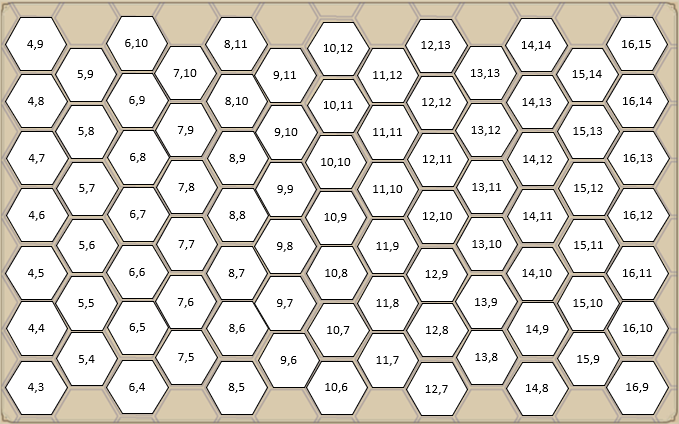
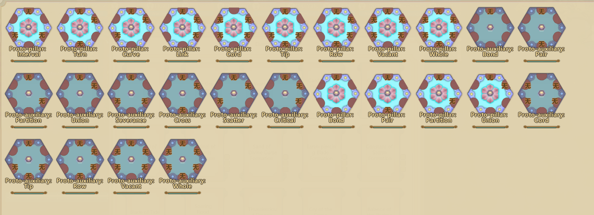

# Formations (Zhen)

This document is about modding formations. First, the locations which are included in the Readme_EN.txt but not translated.

- [Zhen]\Node

Has ZhenNode_*.xml, containing `<ZhenNodeDefs>`. ZhenNodeDefs are the actual formation nodes.
- [Zhen]\NodeLevelInfo

Has nodelevelinfo.xml, containing the levels (0-4) and the colors used.
- [Zhen]\NodeTypeInfo

Has nodetypeinfo.xml, containing the links used by nodes, with their effect set by ZhenSlotDefs.
- [Zhen]\Props

Has SlotProperty.xml, containing the properties used by ZhenSlotDefs and SlotSuits.
- [Zhen]\Propvalue

Has PropertyValue.xml, containing the formation properties.
- [Zhen]\Rule

Has MatchRule.xml, containing the matching types.
- [Zhen]\Slot

Has ZhenSlot.xml, containing `<ZhenSlotDefs>`. ZhenSlotDefs are the effect of link symbols, on both Pillar nodes and auxiliary nodes.
- [Zhen]\SlotSuit

Has SlotSuit.xml and SlotSuit_School.xml, containing Truth of Formations. The requirements for them, as well as their effect. SlotSuit_School.xml is for Sect formations.
- [Zhen]\Suit

Has ZhenSuit.xml, containing `<ZhenSuitDefs>`. ZhenShuitDefs are custom formations, with predefined nodes that give bonuses depending on the amount of nodes unlocked. Used for Ancient Formations.

## Manuals relating to formations

Manuals can contain both Formation nodes and Formation diagrams. 

### Formation nodes
Formation nodes can be added under a `<ZhenNodes>` section.

Each entry (the part within a li) is a single node.
An example of a manual containing a single entry, from ACS_M_EX_02
```xml
    <Esoterica Name="ACS_M_EX_EsotericaZhenFa_2">
		<DisplayName>Formations: Example 02</DisplayName>
		<StarLevel>1</StarLevel>
		<Difficulty>1</Difficulty>
		<Desc>This is the description</Desc>
		<EffectDesc>This is the effect, formated.\nUnlocks Node: \nPaired Sword</EffectDesc>
		<GLevel>Qi</GLevel>
		<Element>None</Element>
		<ZhenNodes>
			<li>ZhenNode_Lv1_Jian_2_1_ACS_M_EX</li>
		</ZhenNodes>
	</Esoterica>
```
### Formation diagrams
Formation diagrams can be added under a `<ZhenShapes>` section.

Each entry (the part within a li) is a single diagram. Each entry consists of three paramters, the Name, ShapeInfo and Descript.
- Name - Name of the diagram, not limited to 7 characters like the diagrams you creat ingame.
- ShapeInfo - The string of the diagram, more detail below
- Descript - The description of the diagram
An example of a manual containing a single entry, from ACS_M_EX_05
```xml
    <Esoterica Name="ACS_M_EX_EsotericaZhenFa_5">
		<DisplayName>Formations: Example 05</DisplayName>
		<StarLevel>1</StarLevel>
		<Difficulty>1</Difficulty>
		<Desc>This is the description</Desc>
		<EffectDesc>This is the effect, formated.\nUnlocks Formation Diagram: \nConcentrated Sword Aura Formation</EffectDesc>
		<GLevel>Qi</GLevel>
		<Element>None</Element>
		<ZhenShapes>
            <li Name="Concentrated Sword Aura Formation">
            <ShapeInfo>10|9|0|ZhenMainNode_Lv1_3_13|10|10|2|ZhenNode_Lv1_2_7|11|10|3|ZhenNode_Lv1_3_13|11|9|5|ZhenNode_Lv1_2_7</ShapeInfo>
            <Descript>A simple formation, using Concentrated Sword Aura as a pillar.</Descript>
            </li>
        </ZhenShapes>
	</Esoterica>
```

## Formation Nodes

Nodes are defined under <ZhenNodeDefs>.  The most basic node example is the auxiliary node Sword.
```xml
<Def Name="ZhenNode_Lv1_1_1" DisplayName="剑" Main="0" Base="2">
    <Lv>1</Lv>
    <Slot>
        <li SlotName="Lv1_Jian" Pos="0"/>
    </Slot>
</Def>
```
- Name - The name of the node, important as it has to be unique.

The ingame node naming logic is as follows:

ZhenNode_Lv(Level on the node)_(Amount of connections)_(Count)

- DisplayName - The ingame name for the node. If you plan on developing for multiple languages, you’d change it with the Language files.

- Main - 0 for auxiliary nodes, 1 for pillar nodes.
- Base - 2 for nodes that can be used, 0 when they’re only used for preset formations (Sect and Ancient)
- `<Lv>` - The level for the node. It has no relation to the types of links used.
- `<Slot>` - The connections. SlotName is from NodeTypeInfo\nodetypeinfo.xml, while the Pos is the position of the connection.

- 0 - Top
- 1 - Upper Right
- 2 - Lower Right
- 3 - Upper Left
- 4 - Lower Left
- 5 - Bottom

Pillars are more complex, as they include Truth of Formations. An example, the Hidden Blade of Positivity:
```xml
<Def Name="ZhenMainNode_Lv1_3_1" DisplayName="玄罡藏锋" Main="1" Base="2">
    <Lv>1</Lv>
    <SlotSuits>
        <li>SlotSuit_1</li>
        <li>SlotSuit_3</li>
        <li>SlotSuit_4</li>
    </SlotSuits>
        <Slot>
            <li SlotName="Lv1_Jian" Pos="0"/>
            <li SlotName="Lv1_Gang" Pos="2"/>
            <li SlotName="Lv1_Ren" Pos="4"/>
        </Slot>
 </Def>
```
- `<SlotSuits>` - Truth of Formations for that pillar node. Truth of Formations are assigned based on the connections used. There are exceptions, but that’s the basic idea.

## Formation Links

Links, auxiliary connections, odd symbols, or simply Slots.

The link itself is under nodetypeinfo.xml. An example of the Sword link in nodetypeinfo.xml
```xml
<Def Name="Lv1_Jian" DisplayName="剑"></Def>
```
- Name - Based on the level of the link, with the symbol used at the end, used internally
- DisplayName - Symbol displayed on the node
The effect of the link is defined under ZhenSlot.xml, in <ZhenSlotDefs>. Here’s the same Sword link effect:
```xml
<Def Name="Lv1_Jian" DisplayName="剑">
    <Lv>1</Lv>
    <SlotType>Lv1_Jian</SlotType> 
    <Effect>
        <li Type="FabaoAtkPowerBasev" Value="1" />
    </Effect>
    <CoreEffect>
        <li Type="FabaoAtkPowerAddp" Value="0.3" />
    </CoreEffect>
</Def>
```
The first line is a repeat from nodetypeinfo.xml
- `<Lv>` - Link level, used for categorizing.
- `<SlotType>` - Used for the symbol matching. Use the Name to keep it simple.
- `<Effect>` - Auxiliary node bonus for matching. The types are defined under Props\SlotProperty.xml
- `<CoreEffect>` - Pillar node bonus for matching. The types are defined under Props\SlotProperty.xml

## Truth of Formations

For the `<SlotSuits>` used in pillars, there are two files, SlotSuit.xml and SlotSuit_School.xml.
An example of the Mind of the Sword in SlotSuit.xml:
```xml
<Def Name="SlotSuit_1" DisplayName="剑之意" Base="0">
    <Conditions>
        <li A="Lv1_Jian" B="Lv1_Jian" Count="8" />
    </Conditions>
    <SuitEffect>
        <li>
            <DisplayName></DisplayName>
            <Description>御器能力额外增加</Description>
            <SuitType>AddZhenProperty</SuitType>
            <TypeExtra>FabaoAtkPowerAddv</TypeExtra>
            <fParam1>10</fParam1>
        </li>
    </SuitEffect>
</Def>
```
- Name - The name used to assign it to the pillar.
- DisplayName - The name displayed for it.  If you plan on developing for multiple languages, you’d change it with the Language files.
- Base value of 0 is used for all Truth of Formations. It indicates whether to activate globally.
- `<Conditions>` - Activation requirement. The Count listed here is double of what’s shown ingame.
- `<SuitEffect>` - Effect for the Truth of Formation.
- DisplayName isn’t used anywhere, everything has it empty.
- Description - Used for the Property shown ingame, Artifact Mastery for Mind of the Sword as an example 
-`<SuitType>` - Either AddZhenProperty (for adding stats, as the one above) or AddSkill (for adding skills)
-`<TypeExtra>` - Used with AddZhenProperty, the properties are listed in Props\SlotProperty.xml
-`<fParam1>` - Used with AddZhenProperty, for the value of the property.

For Addskill, here’s an example that uses it (SlotSuit_14):
```xml
<SuitEffect>
    <li>
        <DisplayName></DisplayName>
        <Description>新增技能：衍化先天</Description>
        <SuitType>AddSkill</SuitType>
        <SParam1>FightSkill_Zhen_RevealZhen1</SParam1>
        <Cost>2</Cost>
    </li>
</SuitEffect>
```
- `<SParam1>` - Skill added, found under Settings\Fight\FightSkillTemplate.
- `<Cost>` - Formation Energy cost for the skill.

Ancient Formations contain `<SuitEffect>` as well, but with one difference, `<RequireCount>`.
- `<RequireCount>` - Amount of activated nodes required to activate that effect.

## Formation Diagrams

This is about `<ShapeInfo>`, previously mentioned under `<ZhenShapes>`. Here is an example of a `<ShapeInfo>` string:

     10|9|0|ZhenMainNode_Lv1_3_13|10|10|2|ZhenNode_Lv1_2_7|11|10|3|ZhenNode_Lv1_3_13|11|9|5|ZhenNode_Lv1_2_7

The `<ShapeInfo>` string consists of multiple nodes. Each node consists of four values and a pipe separating the nodes.

This is a single node without the pipe separator.

     10|9|0|ZhenMainNode_Lv1_3_13

Or when cleaned up:

     X|Y|Z|NodeName

- X - X coordinate for the node
- Y - Y coordinate for the node
- Z - Rotation for the node, 0 for no rotation, 1 for 1 rotation clockwise, up to 5 for 5 rotations clockwise
- NodeName - Name value for the node

The usable X/Y area is below, with X:10;Y:9 in the middle of the screen.



## Ancient Formations

The main difference between a regular custom diagram and an ancient formation is the nodes used. Another aspect is the `<ZhenSuitDefs>`, which defines the ancient formation. A trimmed example from ZhenSuit.xml, the Yin Yang formation:
```xml
<Def Name="yinyangzhen" DisplayName="阴阳二行神阵">
    <Description>自天地阴阳流转中总结而出的阵法，传闻此阵驾驭阴阳之道而布置，阴阳相化，极其灵活。</Description>
    <NodeName>
        <li>阴阳混沌天道</li>
        <li>天道之阴律</li>
        <li>天道之阳律</li>
    </NodeName>
    <SuitEffect>
        <li>
            <RequireCount>3</RequireCount>
            <DisplayName></DisplayName>
            <Description>御器能力额外提高</Description>
            <SuitType>AddZhenProperty</SuitType>
            <TypeExtra>FabaoAtkPowerAddv</TypeExtra>
            <fParam1>9</fParam1>
        </li>
    </SuitEffect>
</Def>
```
- Name - Used for assigning nodes to the Suit, with `<SuitName>`
- DisplayName - Name of the Ancient Formation, shown when hovering over nodes
- Description - Description of the formation.
- `<NodeName>` - List of nodes in the formation, shown when hovering over nodes. Has no relations to the actual nodes used, but should contain the actual names for keeping it clear.
- `<SuitEffect>` - already discussed under Truth of Formations.

After the `<ZhenSuitDefs>`, the other part is the actual node. Here’s the pillar for that node, yinyang_0 under ZhenNode_Suit.xml:
```xml
<Def Name="yinyang_0" DisplayName="阴阳混沌天道" Main="1" Base="0">
    <SlotSuits>
        <li>SlotSuit_SpZhen_7</li>
    </SlotSuits>
    <Lv>5</Lv>
    <Slot>
        <li SlotName="Lv3_Yin" Pos="0"/>
        <li SlotName="Lv3_Yang" Pos="5"/>
    </Slot>
    <Suit>
        <li>
            <Condition>
                <li>
                    <GongLevelNeed>God</GongLevelNeed>
                    <DaoHangNeed>360</DaoHangNeed>
                    <EsotericaNeed>Other_Esoterica_ZhuLongDan</EsotericaNeed>
                    <EquipmentNeed>Item_BossZhuLong_LongYu</EquipmentNeed>
                        <li>
                            <EquipmentNeed>Item_MiBao_YinYangZhenTu</EquipmentNeed>
                        </li>
                    </li>
            </Condition>
            <SuitName>yinyangzhen</SuitName>
            <V>0</V>
        </li>
    </Suit>
</Def>
```
The overall structure is based on regular nodes, with some exceptions.
- Name - Formatting is based on the formation where it’s used and which node it is (ZhenShapes order)
- `<SlotSuits>` - Uses Truths of Formations unique to that formation, found at the end of SlotSuit.xml.
- `<Lv>` - For all Ancient Formation nodes is 5.
- `<Suit>` - Where the Ancient Formation information is set.
- `<Condition>` - Where the node activation condition is set. You can have multiple conditions, you can also have no conditions.
- `<SuitName>` -  The name of the Ancient Formation as used in `<ZhenSuitDefs>`
- `<V>` - Order of the node, based on `<NodeName>` order in `<ZhenSuitDefs>`

An example condition is below:
```xml
<Condition>
        <li>
            <SexNeed>Male</SexNeed>
            <GongLevelNeed>God</GongLevelNeed>
            <MaxLingNeed>99999</MaxLingNeed>
            <DaoHangNeed>200</DaoHangNeed>
            <EquipmentNeed>Item_MiBao_ZhuXianZhenTu</EquipmentNeed>
            <EsotericaNeed>ManualName</EsotericaNeed>
            <SkillNeed Type="Fabao" Level="20"/>
            <GongKindCondition GongKind="None" GongName="dddddd"/>
        </li>
</Condition>
```
- `<SexNeed>` - Used for limiting the gender of the cultivator, either Male or Female, None isn’t used
- `<GongLevelNeed>` - Minimum state of the cultivator. Qi (Qi Shaping) < Dan1 (Core Shaping) < Dan2 (Golden Core) < God (Primordial Spirit) < God2 (Demi-God)
- `<MaxLingNeed>` - Minimum Qi cap required
- `<DaoHangNeed>` - Minimum Attainment (overall) required
- `<EquipmentNeed>` - Item required for activation. Mostly used with Pillars and Diagrams
- `<EsotericaNeed>` - Manuals learned required for activation
- `<SkillNeed>` - Minimum Skill level required
- `<GongKindCondition>` - should set a requirement for the element or name of the law of the cultivator, but it doesn't work that way

To set a certain Gong requirement or a specific element, use `<GongNeed>` instead of `<GongKindCondition>`.

You can have multiple `<li>` under a single condition, but you can’t stack them into each other. This is why the node above doesn’t require the diagram for activation.

## General concepts

- Making custom diagrams can be done ingame. Make the diagram, save it with a recognizable name, and rip the string from the save file.
- For planning out custom diagrams using custom nodes, using Prototype nodes is heavily recommended.

If you're planning to make a large amount of custom nodes, there are a limited amount of permutations with a single symbol. Mixed nodes are another matter, and I won't be touching them.

Here they are using the Prototype links:


Using the same terms, they can be categorized as:

### Single link nodes

A single possible configuration, Bond, a single link at 0

### Double link nodes

Three possible configurations.
- Pair - 2 links at 0 and 5
- Partition - 2 links at 0 and 2
- Union - 2 links at 0 and 1

### Triple link nodes

Four possible configurations.
- Severance - 3 links at 0,2,4
- Cross - 3 links at 0,1,5
- Scatter - 3 links at 0,1,4
- Critical - 3 links at 0,1,2

### Quadruple link nodes

Three possible configurations.
- Cord - 4 links at 1,2,3,4
- Tip - 4 links at 0,2,4,5
- Row - 4 links at 0,1,2,5

### Pentuple link nodes

A single possible configuration, Vacant, 5 links at 0,1,2,3,4

### Hextuple link nodes

A single possible configuration, Whole, 6 links at 0,1,2,3,4,5