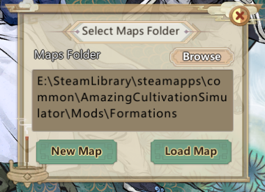
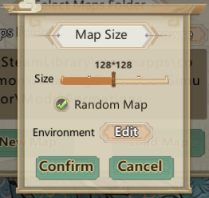
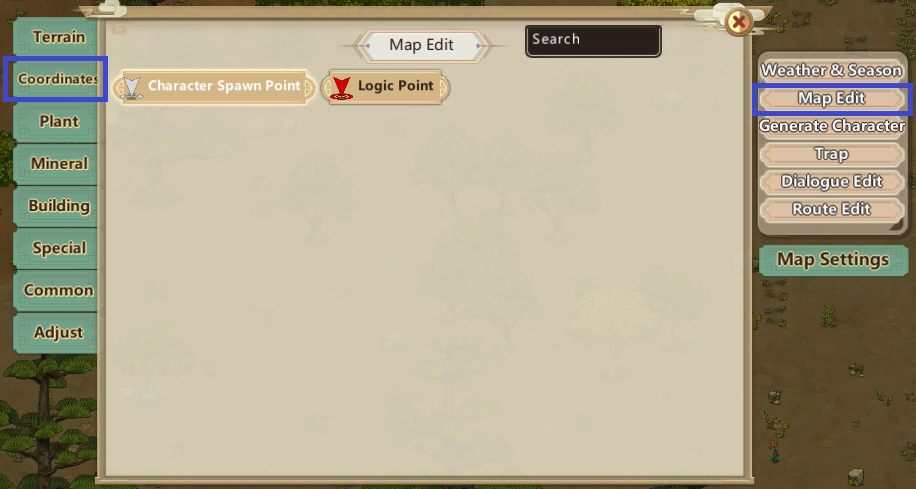

# Map Making

This document is about creating custom maps with Map Editor, listed on the Title Screen when Developer Mode is enabled.

Currently, it's a translation of two files (`冒险模式制作入门（地图编辑）.docx` and `自制门派地图配置方法.docx`) in the Mods folder.

## Getting started in Adventure mode

This section is a translation of the first file, which goes over most of RPG Map making. Additional descriptions have been added.

### Creating a map

First step for creating custom maps is enabling `Developer Mode` under Settings. When it is enabled, Map Edit is now visible in the title screen. Clicking on it will show the following window:



Now, select the working directory for Map Making. This would be a Mod in your Mods folder, the image above utilized a local mod with the name `Formations`. Click on Browse, and locate your desired folder.

When the working directory for Map Making has been assigned, New Maps can be created. Once maps have been saved into that directory, they can also be loaded. Creating a New Map will show the following window:



* Size Slider - Map Size, possible values are:
    * 48x48
    * 96x96
    * 128x128
    * 196x196
    * 256x256
* Random Map - If selected, a random basic map based on the Environment will be generated. Otherwise, an empty map will be generated.
* Environment - Similar to Classic/Land of Illusion, but limited to Map Seed, and Abode (or Biome).

When the attributes are in their desired state, clicking on `Confirm` starts the Map Generating process. Once a Map has been generated, it's time to place the Spawn Point. Click on `Map Edit` in the upper right corner, and `Coordinates` to open up the Coordinate tab. Select the `Character Spawn Point`, and place it on the map.



Once a `Character Spawn Point` has been placed, the minimum has been done, and the Map can be saved. Click on `System` in the bottom right corner, and select `Map Save`. A Save window pops up, name the newly created map, and save it.

The name must be unique, as it will be used in multiple places later on. Similarly to other naming logics, the use of suffixes and prefixes is strongly recommended. Once the map has been saved, it can be found in the `Working Directory`(chosen earlier)\Settings\RPG\Maps, where each folder corresponds to a different map.

#### Scripting

For each created map that's going to be utilized, a lua file needs to be created in `Working Directory`\Scripts\Rpg\World\Map directory. The basic content is as follows:

```lua
local emap = GMod.RPG.R.Map:Register(“MapName”)
```

After the map is created, a World corresponding to the Map needs to be defined. Similarly to the previous file, a lua file in `Working Directory`\Scripts\Rpg\World\Worlds directory. The basic content is as follows:

```lua
local w = GMod.RPG.R.World:Register(“WorldName”)

w._FromMod = LOAD_FILE_MOD --  THIS LINE MUST NOT BE MOVED
w.FirstMap = "“MapName”" --The default map name when entering the world

function w:BackSchool(slrpg)
--	CS.XiaWorld.RPGMapMgr.Instance:DoOverrideNpc(true, true)
-- The above sentence is to cover the state in the RPG map to the state of the Sect NPC, see the interface description for details
end
```

If you need to modify the default map when entering the map according to the situation, you can override this function:
```lua
function _bw:GetEnterMap(slrpg, savedata)
	return self.FirstMap
end
```

After the scripts have been made for both the World and Map, the RPG Info (world related) needs to be added, in the form of a Definition in RPGInfo.xml, a local example can be found in `[INSTALLDIR]\Mods\Example\Settings\RPG\Info\RPGInfo.xml`
An example of RPGInfo.xml contents:

```xml
<Defs><List>
    <Def Name="WorldName">
        <Title>Example Adventure</Title>
        <Desc>An adventure used as an example.</Desc>
        <MinEnterNpc>1</MinEnterNpc>
        <MaxEnterNpc>5</MaxEnterNpc>
        <NeedUnlock>0</NeedUnlock>
        <Places>
            <li>Place_BirthPlace15</li>
        </Places>
    </Def>
</List></Defs>
```

The Above would add WorldName as an adventure to Place_BirthPlace15(Ruins of Taiyi). At this point, the map can be entered through regular gameplay. Testing it through console commands is also a possibility, for that particular world would look like:
```lua
local npcs = World.map.Things:GetPlayerActiveNpcs()
RPGMapMgr:EnterRPGWorld(npcs, "WorldName");
```